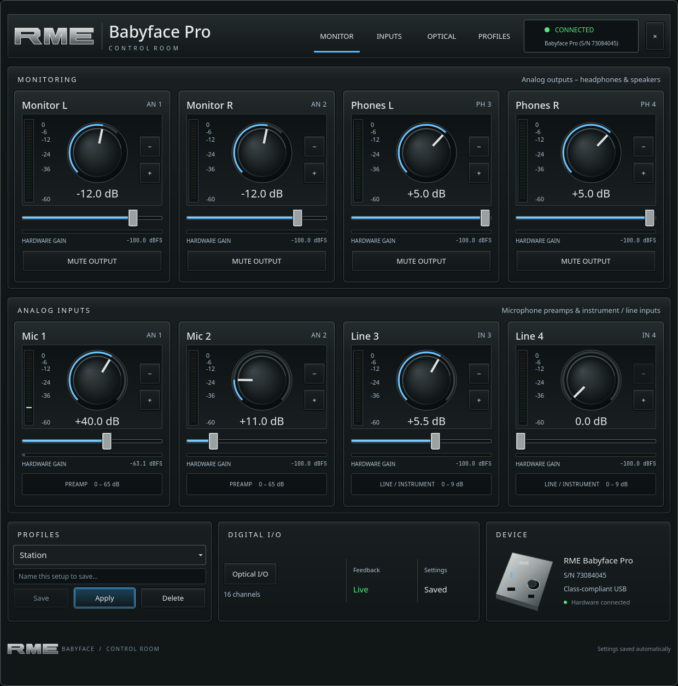

# Omarchy Plugins — Babyface Control

A native control-room panel for the RME Babyface Pro: hardware gains, live meters,
automatic persistence, and named profiles. Open it from the headphones icon in
the Omarchy bar. A community plugin maintained by KB2UKA.



## Install

Requires Linux, Omarchy 4 with Quickshell, Python 3.11 or newer, and ALSA (`libasound`). The
Babyface must be in **class-compliant mode**. No Python packages or administrator
permissions are needed. The existing USB audio driver remains attached.

```bash
git clone https://github.com/Kb2uka/Omarchy-Plugins.git
cd Omarchy-Plugins
python3 install.py
omarchy-shell kb2uka.babyface open
```

The installer creates a user-owned plugin and a user systemd service. It backs up
existing plugin files, shell settings, service configuration, and saved gains.
Run the installer again to update. If the desktop still shows the old panel,
run `omarchy restart shell` to clear its component cache. This reloads the
desktop bar; the separate hardware service and audio applications keep running.
Cloning with `omarchy plugin add` alone does
not install the companion service; run `install.py` from the checkout.

### Filesystem safety

Installation and settings access require absolute paths with user-owned,
non-symlink directories. User directories and existing files must not permit
writes by other users. Root-owned system ancestors may precede the user-owned
path. Existing inputs must be regular files owned by the current user with one
hard link, no symlinks, and a maximum size of 1 MiB per file. These checks also
apply recursively to plugin backups; unsafe entries stop installation.

Reads use bounded no-follow file descriptors. Service units, settings, and
backup files use exclusively created, private (0600) temporary files in the
same directory, followed by checked atomic replacement and directory sync.
Existing profiles remain intact when a write fails before replacement.

If setup reports an unsafe path, inspect that path and restore a normal
user-owned directory or file from a trusted backup before retrying. The
installer does not follow links or repair permissions automatically. Uninstall
leaves saved-state files untouched, including linked files, and can remove a
linked plugin directory without following it. An unsafe service unit is rejected
before service-management commands run; restore that unit from a trusted backup
before uninstalling. Run installation and development checks as your normal
user, from a user-owned checkout with no shared write permissions.

## Controls

- Four analog input preamps: microphone inputs 1–2 (0–65 dB) and line/instrument
  inputs 3–4 (0–9 dB, in half-dB steps).
- Twelve hardware output gains, including the two headphone channels. Mute is
  separate from the numeric gain. Drag, use the +/− buttons, or focus a slider
  and use the arrow keys. Rotary knobs support vertical dragging and arrow keys. A muted output is restored by choosing a slider value.
- Live peak meters for all twelve inputs and twelve outputs. Optical inputs
  have no analog gain stage and display unity.
- Save the current setup under a name; select and apply a profile to recall it.
  Saving an existing name replaces that profile. Delete removes the selected
  profile after the panel's second-click confirmation.

The interface reads the device every 100 ms. Physical controls update the
display through the Babyface's MIDI state reports; changing a slider waits for
the hardware's confirmation. A stale or disconnected device disables controls.
The application does not read ALSA's cached gain values as live feedback.

The hardware reports absolute gains for four analog inputs and six outputs
(AN1/2, PH3/4, optical 1/2). The remaining six ADAT outputs are labeled **Last
software setting** because the device's documented state packet has no gain
fields for them. They start unknown until applied, and are included in saved
profiles only after transmission. Their meters still use hardware data.

## Persistence

The first connection adopts the current hardware settings. Subsequent hardware
and panel changes are saved automatically. The service restores the last saved
gains after login or device reconnection, isolated by the Babyface's serial
number. Reopening the panel does not restore or rewrite anything.

Settings and profiles: `~/.local/state/babyface-control/settings.json`.
Backups: `~/.local/state/babyface-control/backups/`.
The panel changes gain settings only; audio routing remains owned by your
patchbay, and application projects remain owned by their applications.

## Verify and troubleshoot

```bash
systemctl --user status babyface-control
python3 ~/.config/omarchy/plugins/kb2uka.babyface/babyface.py status
journalctl --user -u babyface-control --since '5 minutes ago'
```

If MIDI is busy, close another hardware-control application that owns Babyface
Port 2. The service reconnects automatically. It never disconnects the audio
driver or changes the interface's mode. With multiple Babyfaces attached it
asks for one device rather than choosing silently.

Optional command-line access uses the same serialized service:

```bash
python3 babyface.py profile save 'Voice'
python3 babyface.py profile load 'Voice'
python3 babyface.py set mic1 40
python3 babyface.py set out3 5
```

Uninstall while retaining saved profiles:

```bash
python3 install.py --uninstall
```

## Development

```bash
python3 -m unittest discover -s tests -p 'test_*.py'
bash tests/ui/run.sh
bash tests/ui/native-parse.sh
omarchy plugin validate .
```

The backend uses Python's standard library and `libasound` through `ctypes`.
The UI is QML integrated through Omarchy's native plugin contract. Unit tests
never open a hardware device or network socket. Headless Qt tests exercise
sliders, profiles, meter updates, stale state, and responsive layouts.

This is a Linux/Omarchy application, tested on x86-64 with Babyface Pro. The
source avoids architecture-specific layouts; physical arm64 and Pro FS
validation remain outstanding. See [protocol notes](docs/protocol.md).

MIT license. Copyright KB2UKA.

## Interface

The graphite console keeps monitoring above analog inputs, with profiles and
device status below. Blue arcs and precision faders control the same hardware
gains. Vertical meters show measured levels, peak hold, and clipping. Narrow
windows scroll the console without rearranging individual channel controls.
Optical I/O expands from its tab or lower control.

The panel exposes only supported device features. It has no phantom-power,
PAD, instrument-mode, routing, clock, or firmware controls. Those features are
not implemented as decorative buttons. Device serial, connectivity, gains,
meters, saved state, and profiles come from the running service.
